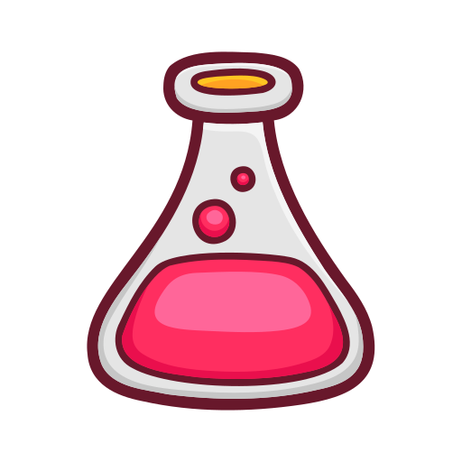

<h1 align="center">  RefactoringLab</h1>

  <b>A collection of poorly written codes with tests where you can practice improving them and submit better versions</b> 

 

Welcome to RefactoringLab, a repository dedicated to improving coding skills through refactoring challenges. Here, you'll find a collection of poorly written code snippets accompanied by tests. Your task is to refactor the code to make it more efficient, readable, and maintainable while ensuring that the tests still pass.

## Getting Started

1. Fork this repository and clone it.
2. Choose a code snippet you'd like to work on from the "challenges" directory.
3. Refactor the code while making sure the tests in the "tests" directory still pass.
4. If the tests pass and you're satisfied with your changes, submit a pull request.

Happy refactoring!

## Feedback and Discussion

Join the discussion on [our Discord server](#) to share your ideas, ask questions, and learn from others' approaches.

## Get $200 DigitalOcean Credit

## 🔖 License

This project is licensed under the MIT License - see the [LICENSE.md](https://github.com/saleem-hadad/finance/blob/main/LICENSE) file for details.
